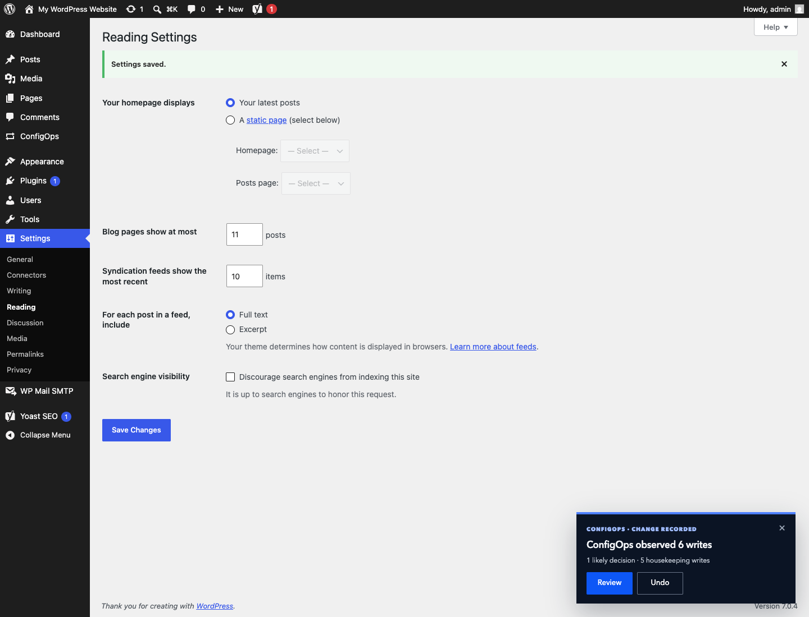

<p align="center">
  <picture>
    <source media="(prefers-color-scheme: dark)" srcset="assets/brand/configops-wordmark-dark.svg">
    
  </picture>
</p>

<p align="center"><strong>Know what WordPress changed. Undo only what ConfigOps can prove.</strong></p>

<p align="center">
  v0.1.0
  &nbsp;·&nbsp; Local recorder
  &nbsp;·&nbsp; No account required
</p>

<br>

<p align="center">
  
</p>

<p align="center"><sub>An actual WP Mail SMTP capture. The password is removed before storage; seven supported settings remain undoable.</sub></p>

## One settings save, explained

Start a named capture, use WordPress normally, then stop. ConfigOps groups the writes caused by each request and separates the settings you chose from plugin housekeeping, secrets, and changes it cannot safely interpret.

```diff
WP Mail SMTP → Sender email
- admin@localhost.test
+ noreply@agency.example

WP Mail SMTP → SMTP password
- [removed before storage]
+ [removed before storage]
```

Every undo is checked against the current value first. If the website changed again, ConfigOps refuses to overwrite it. If capture evidence is incomplete, whole-capture undo is disabled rather than presented as safe.

## Support is a contract

| Integration | Tested release | Capture | Explain | Secrets | Undo |
|---|---:|:---:|:---:|:---:|:---:|
| WordPress Options API | WordPress 7.0 | Supported | Nested diff + media identity | Redacted | Conflict-checked |
| WP Mail SMTP Free | 4.9.0 | Supported | Supported | Removed | With limits |
| Yoast SEO Free | 28.2 | Supported | Supported | Removed | With limits |
| Unknown plugins | — | Options API only | Needs review | Conservative | Only when proven safe |

The exact field coverage and limitations are available inside **ConfigOps → Plugin support**. Versions outside a tested adapter range keep their evidence, but automatic undo is disabled.

## First capture

1. Install ConfigOps from WordPress.org once it is listed, or use a release ZIP provided by pyrra.
2. In WordPress, open **Plugins → Add Plugin**. Use **Upload Plugin** when installing a ZIP.
3. Activate ConfigOps and open **ConfigOps** in the admin menu.
4. Name the capture, record one settings change, then stop and review it.

Requires WordPress 7.0 or newer and PHP 8.3 or newer.

> **Technical preview:** v0.1 is a local, single-site configuration recorder—not a backup or a promise of transactional rollback. It does not deploy content, synchronize databases, manage fleets, or generically understand custom plugin tables.

## Safety model

- probable credentials are redacted before mutation history is written;
- capture evidence stays in the website database and is not sent to pyrra or another service;
- direct custom-table writes produce value-free warnings, never stored SQL;
- site icons, site logos, every supported Yoast social-image ID, publisher-policy page, content-ignore entry, LLMs.txt page, and represented-person selector retain bounded local identity; referenced objects are never copied or deleted;
- restore operations are serialized, audited, conflict-checked, and compensated when possible;
- interrupted, incomplete, or version-uncertain evidence fails closed;
- while ConfigOps is active, completed local history is retained for 30 days by default;
- uninstalling ConfigOps removes its capture history, installation options, scheduled cleanup, and capabilities.

Release Packs, Plans, Policies, and Drift are the direction after the recorder earns trust.

## Development

For a persistent local WordPress installation with MariaDB, WP-CLI, Query Monitor,
Xdebug, Mailpit, and the supported WP Mail SMTP and Yoast versions:

```bash
npm ci
npm run wp:start
```

Open `http://localhost:8888/wp-admin/` and sign in with `admin` / `password`.
The repository is mounted directly as the active `configops` plugin, so PHP changes
are available immediately. Rebuild UI changes with `npm run build:ui`.

Useful commands:

```bash
npm run wp:cli -- plugin list       # Run WP-CLI in the container
npm run wp:debug-log                # Follow wp-content/debug.log
npm run wp:logs                     # Follow Apache/PHP container output
npm run wp:stop                     # Keep data, stop containers
npm run wp:down                     # Keep data, remove containers
npm run wp:reset                    # Delete the local database/site and recreate it
```

Xdebug listens on port `9003` and uses the server path
`/var/www/html/wp-content/plugins/configops`. It starts only when an IDE/browser
debug trigger is present. Start the IDE listener and add `?XDEBUG_TRIGGER=1` to a
request to debug it. Copy `.env.example` to `.env` to change host ports or set
`XDEBUG_MODE=off`. MariaDB is reachable on `127.0.0.1:3307` with database/user/
password `wordpress` / `configops` / `configops`.

Captured development mail is available at `http://localhost:8025`. To exercise the
WP Mail SMTP adapter, select its **Other SMTP** mailer and use host `mailpit`, port
`1025`, no encryption, and no authentication.

For a disposable, in-memory WordPress Playground instead:

```bash
npm install
npm test
npm run dev
```

The recorder is PHP because it observes the WordPress hook lifecycle. The review interface is made of route-specific React islands, with React supplied by WordPress. ConfigOps-owned JavaScript is held below a 24 KiB gzip release budget and shipped in human-readable form.

Architecture decisions: [capture and storage](docs/architecture.md) · [React islands](docs/frontend.md) · [adapter contracts](docs/adapters.md)

Created by **pyrra**. Licensed under [GPL-2.0-or-later](LICENSE).
