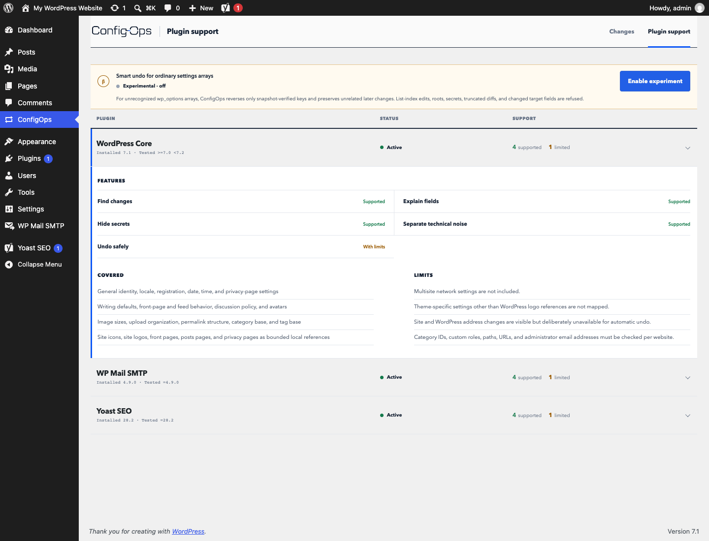

<p align="center">
  <picture>
    <source media="(prefers-color-scheme: dark)" srcset="assets/brand/configops-wordmark-dark.svg">
    
  </picture>
</p>

<p align="center"><strong>The undo layer for WordPress settings.</strong></p>

<p align="center">
	<strong>Agent-ready. Human by default.</strong><br>
	<sub>Agents can inspect and plan. One explicit danger flag can authorize a guarded undo.</sub>
</p>

<p align="center">
  v0.6.0
  &nbsp;·&nbsp; Agent-readable operations
  &nbsp;·&nbsp; No account required
</p>

<p align="center">
  <a href="https://playground.wordpress.net/?blueprint-url=https%3A%2F%2Fraw.githubusercontent.com%2FPyrraNet%2FConfigOps%2Fv0.6.0%2F.wordpress-org%2Fblueprints%2Fblueprint.json">Try the live demo</a>
  &nbsp;·&nbsp;
  <a href="https://configops.pyrra.net/docs/">Read the operations &amp; safety docs</a>
</p>

<br>

<p align="center">
  
</p>

<p align="center"><sub>One WordPress settings save produced six writes: one likely decision and five housekeeping values. ConfigOps recorded both and offered conflict-checked Undo.</sub></p>

## The undo button WordPress forgot

WordPress shows you the settings form. ConfigOps shows you what the save actually changed.

Change a supported WordPress or plugin setting as usual. ConfigOps opens one isolated observation for that request, groups its writes, collapses repeated same-owner writes to one option into the original-to-final decision, and separates the settings you chose from plugin housekeeping, secrets, and changes it cannot interpret. The resulting evidence card links to the recorded diff and offers whole-save Undo only when every value is restorable.

**One action → hidden writes → a clear diff → conflict-checked undo.**

Named Change Sessions remain the focused mode for planned maintenance, support cases, and investigations that span several requests.

On a network-active Multisite installation, every site keeps an isolated local ledger while Network Admin receives a separate network-wide evidence view. Multi-Network installs are pinned to each site's actual network ownership: lifecycle work refuses a site from another network, and a foreign Network Options write never enters the current network's evidence. Network administrators can group planned work into named Network Change Sessions. Complete Network Options additions and updates can be undone one mutation at a time after the same conflict and compensation checks; deletes and whole-session undo remain unavailable.

WP-CLI changes are observed even when the optional global `--user` argument is omitted; those shell-authorized observations use actor ID `0` instead of inventing a WordPress user. Site and network restores fail before writing when an option's runtime read is virtualized by a WordPress Options API filter, because the filtered value may differ from the database state ConfigOps would change.

```diff
WP Mail SMTP → Sender email
- admin@localhost.test
+ noreply@agency.example

WP Mail SMTP → SMTP password
- [removed before storage]
+ [removed before storage]
```

Every undo is checked against the current value first. If the website changed again, ConfigOps refuses to overwrite it. If observation evidence is incomplete, whole-save undo is disabled rather than presented as safe.

## Verified key undo without an adapter

Version 0.6 can undo verified setting keys from ordinary plugin arrays even when ConfigOps has no dedicated adapter for that plugin. Those captures retain the responsible plugin slug and, when WordPress can resolve its main file, the installed version observed at save time. When a plugin registers an option through the WordPress Settings API but Core performs the final write, ConfigOps records that registered ownership separately instead of claiming the plugin called `update_option()`. Nested leaf keys receive readable labels, while the review still states that ConfigOps does not know their plugin-specific meaning. A site administrator explicitly enables **Verified key undo for plugin arrays** under **ConfigOps → Support contracts**. For an unclaimed associative `wp_options` update, ConfigOps then treats the captured before value, captured after value, and current value as a three-way check:

<p align="center">
  
</p>

- every patch entry must agree with both typed snapshots;
- every target key must still equal its captured after-state;
- the complete patch is refused if one target conflicts;
- unrelated keys added or changed later are preserved.

This remains deliberately experimental and site-local. It does not infer plugin semantics or override an adapter contract, and it refuses roots, integer-keyed parent arrays, list-index edits, secrets, redacted or truncated evidence, malformed or overlapping paths, autoload drift, and custom-table writes. Eligibility rechecks current adapter ownership, while apply rechecks that every current parent is still an unambiguous associative map.

## Support is a contract

| Integration | Tested release | Observe | Explain | Secrets | Undo |
|---|---:|:---:|:---:|:---:|:---:|
| WordPress Core | WordPress 7.0–7.1 | Supported | Field map + local references | Redacted | With limits |
| WordPress Multisite / Multi-Network | WordPress 7.0–7.1 | Sites + Network Options | Generic network evidence | Redacted | Network additions/updates |
| WP Mail SMTP Free | 4.7–4.9 | Supported | Supported | Removed | With limits |
| Yoast SEO Free | 28.1–28.3 | Supported | Supported | Removed | With limits |
| WooCommerce | 10.3, 10.7, 10.9, 11.0 | Core settings + feature flags | Settings API audit | Bank details removed | With storage limits |
| Plugins without an adapter | Detected caller or Settings API owner | Options API only | Source basis, version, and readable leaf keys; semantics unverified | Conservative | Exact undo; opt-in verified array-key experiment |

Plugin ranges cover every version line that the official WordPress.org usage API exposed separately on 2026-08-24. CI checks the live API and fails when a newly visible line has no real-plugin contract. Each release contract also compares ConfigOps with the plugin’s own option map, registered defaults, or Settings API; a newly exposed unknown field fails CI. WordPress.org combines the remaining installations under `other` without naming their versions, so ConfigOps does not pretend that bucket is verified. The exact field coverage and limitations are available inside **ConfigOps → Support contracts**. Versions outside a tested adapter range keep their evidence, but automatic undo is disabled.

## First change

1. Install ConfigOps from WordPress.org, or use a release ZIP provided by pyrra.
2. In WordPress, open **Plugins → Add Plugin**. Use **Upload Plugin** when installing a ZIP.
3. Activate ConfigOps, change one WordPress or plugin setting, and save it.
4. Use the ConfigOps evidence card to review the writes or undo a save whose recorded values all pass the restore policy. Open **ConfigOps** to start a named Change Session for wider work.

Requires WordPress 7.0 or newer and PHP 8.2 or newer. PHP 8.2 is the oldest supported runtime; production sites should prefer a newer actively supported PHP branch.

> **Version 0.6 scope:** ConfigOps supports both single-site WordPress and network-active Multisite. Site evidence remains isolated per site; Network Admin has automatic and named Network Options evidence plus guarded add/update undo. Opt-in verified key undo extends site-option patches beyond dedicated adapters, but ConfigOps remains neither a backup nor a generic database rollback, cross-site bulk console, or fleet manager.

## Automation and agents

ConfigOps is **Agent Ready** through native WordPress Abilities and machine-readable JSON `wp configops` commands. An authorized tool can inspect site state and recorded mutations, start or stop a named Change Session, and run the real conflict and reference checks as a read-only restore plan. Human approval remains the default. A service user with the separate `configops_apply` capability can intentionally replace that approval for one mutation by sending `dangerouslyRunUndo: true` or the matching WP-CLI flag. Compatible MCP adapters can expose the same abilities as tools.

```bash
wp --user=configops-agent configops state
wp --user=configops-agent configops captures list --limit=20
wp --user=configops-agent configops restore plan --mutation=842
wp --user=configops-agent configops restore apply --mutation=842 --dangerously-run-undo
```

The danger flag skips only the human confirmation step. Apply still repeats site-scope, active-capture, eligibility, reference, filtered-read, autoload, current-value, adapter, lock, audit, verification, and compensation checks through the ordinary restore service. The command is limited to one mutation, is marked destructive and non-idempotent, and exposes no generic option writer. Native abilities can be discovered through authenticated WordPress REST and translated by compatible MCP adapters. See [Automation & agents](docs/guide/automation.md) for the complete vocabulary, capability map, privacy boundary, and service-user guidance.

## Safety model

- probable credentials are redacted before mutation history is written;
- touched admin fields are correlated locally using names and visible labels only; the observer never reads their configuration values and its evidence never expands undo permissions;
- observation evidence stays in the website database and is not sent to pyrra or another service;
- direct custom-table writes produce value-free warnings, never stored SQL;
- site icons, site logos, every supported Yoast social-image ID, publisher-policy page, content-ignore entry, LLMs.txt page, and represented-person selector retain bounded local identity; referenced objects are never copied or deleted;
- restore operations are serialized, audited, conflict-checked, and compensated when possible;
- retention shares the restore mutex in each site or network scope, so cleanup cannot remove evidence from an in-flight undo;
- interrupted, incomplete, or version-uncertain evidence fails closed;
- while ConfigOps is active, completed local history is retained for 30 days by default;
- uninstalling ConfigOps removes its observation history, installation options, scheduled cleanup, and capabilities.

## Development

For a persistent local WordPress installation with MariaDB, WP-CLI, Query Monitor,
Xdebug, Mailpit, and the current WP Mail SMTP, Yoast, and WooCommerce contract releases:

```bash
npm ci
npm run wp:start
```

Open `http://localhost:8888/wp-admin/` and sign in with `admin` / `password`.
The repository is mounted directly as the active `configops` plugin, so PHP changes
are available immediately. Rebuild UI changes with `npm run build:ui`. The generated
`assets/ui/` bundles are intentionally not tracked by Git; release builds create them
from the sources in `ui/`.

Useful commands:

```bash
npm run test:adversarial            # Hostile cookies, payloads, secrets, and value shapes
npm run test:minimum                # Full PHP path on the oldest supported PHP 8.2 runtime
npm run test:multisite              # Network observation plus Multisite isolation, retention, lifecycle, migration, and cleanup
npm run test:network-visual         # Browser-check Network Admin save, review, and undo at configops.test
npm run test:coverage               # Fails below 70% overall or 75% trust-boundary line coverage
npm run test:docs                   # Build and browser-check every documentation route
npm run wp:cli -- plugin list       # Run WP-CLI in the container
npm run wp:debug-log                # Follow wp-content/debug.log
npm run wp:logs                     # Follow Apache/PHP container output
npm run wp:stop                     # Keep data, stop containers
npm run wp:down                     # Keep data, remove containers
npm run wp:reset                    # Delete the local database/site and recreate it
```

Xdebug listens on port `9003` and uses the server path
`/var/www/html/wp-content/plugins/configops`. It starts only when an IDE/browser
debug trigger is present. Start the IDE listener and add `?XDEBUG_TRIGGER=1` to a
request to debug it. Copy `.env.example` to `.env` to change host ports or set
`XDEBUG_MODE=off`. MariaDB is reachable on `127.0.0.1:3307` with database/user/
password `wordpress` / `configops` / `configops`.

Captured development mail is available at `http://localhost:8025`. To exercise the
WP Mail SMTP adapter, select its **Other SMTP** mailer and use host `mailpit`, port
`1025`, no encryption, and no authentication.

For a disposable, in-memory WordPress Playground instead:

```bash
npm install
npm test
npm run dev
```

The recorder is PHP because it observes the WordPress hook lifecycle. The review interface is made of route-specific React islands, with React supplied by WordPress. ConfigOps-owned JavaScript is held below a 24 KiB gzip release budget and shipped in human-readable form.

Documentation: [operations & safety](https://configops.pyrra.net/docs/) · [observation and storage](docs/architecture.md) · [test and coverage evidence](docs/testing.md) · [React islands](docs/frontend.md) · [adapter contracts](docs/adapters.md)

Created by **pyrra**. Licensed under [GPL-2.0-or-later](LICENSE).
